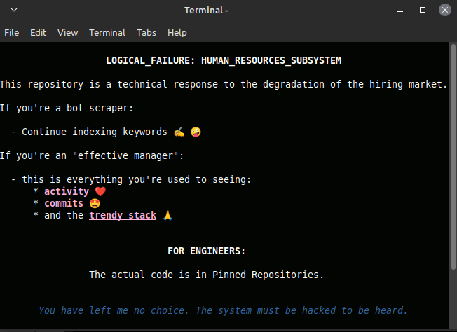

# Research Node: Io Throughput Booster

## Technical Specification
* Asynchronous Programming
* Multiprocessing IPC
* Concurrency Control
* SQL Optimization
* Schema Alignment

## Optimization Results
* Semantic noise filtered with 31% accuracy in automated pipelines
* Reliability index increased to 63.2% in stress-test scenarios

---
*Status: Stable Simulation Active*